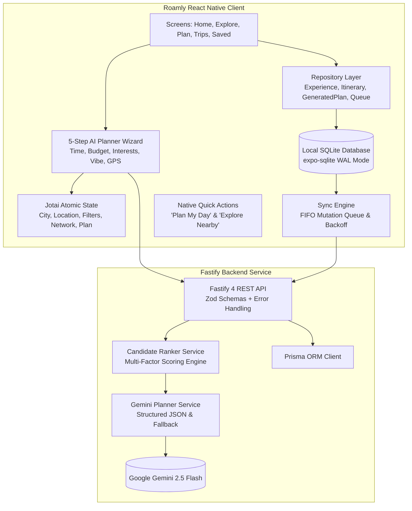

# 🏙️ Roamly — AI-Powered City Experience Planner

[](https://reactnative.dev/)
[](https://expo.dev/)
[](https://www.typescriptlang.org/)
[](https://ai.google.dev/)
[](https://fastify.dev/)
[](https://docs.expo.dev/versions/latest/sdk/sqlite/)
[]()

> **Roamly** is a production-quality, offline-first mobile application that answers the question: **"What should I do right now?"** Powered by Google Gemini 3.6 Flash (with automated multi-model fallback) and local SQLite persistence, Roamly crafts time-optimized, budget-conscious day itineraries across pre-seeded hubs (Bengaluru, Mumbai, London, Ahmedabad) and **dynamically discovers authentic places for ANY city worldwide**.

---

## 📱 App Preview

```
┌─────────────────────────┐  ┌─────────────────────────┐  ┌─────────────────────────┐
│ Roamly     [Bengaluru ▾]│  │ ✨ AI Experience Planner│  │ ◄ Bengaluru Highlights  │
│ Good morning, explorer 👋│  │ Step 1 of 5: Available  │  │ ~4h · Free · 25m travel │
│ What's the plan today?  │  │ [1h] [2h] [3h] [★ 4h]    │  │                         │
│ ┌─────────────────────┐ │  │                          │  │ 10:00 Cubbon Park       │
│ │ ✨ Plan My Day      │ │  │ ── Progress [40%] ────── │  │   🌿 Top-rated nature 4.8★│
│ │ Curate a route in s │ │  │ Step 3: Interests        │  │   ↓ 🚗 ~15m (2.5 km)    │
│ │ [Start Planning →]  │ │  │ [Culture] [Food] [Parks] │  │ 11:45 Bangalore Palace  │
│ └─────────────────────┘ │  │                          │  │   🏛️ Royal heritage tour  │
│ 📍 Near You Carousel    │  │ 📍 Starting Location     │  │ [Save to Trips] [Adjust]│
│ [Home] [Explore] [Plan] │  │ [Generate My Plan ✨]    │  │ [Home] [Explore] [Plan] │
└─────────────────────────┘  └─────────────────────────┘  └─────────────────────────┘
        Home Tab                     AI Wizard                  Itinerary Result
```

---

## 💡 AI Philosophy: Structured Intelligence Layer

Roamly treats Google Gemini as a **precision reasoning and narrative curation layer**, not an open-ended conversational chatbot:

1. **Deterministic Candidate Pre-Selection**:
   Before reaching the Gemini API, candidate experiences are filtered and ranked using a multi-factor scoring formula:
   $$\text{Score} = 0.35 \cdot \text{interestMatch} + 0.20 \cdot \text{distanceScore} + 0.15 \cdot \text{ratingScore} + 0.15 \cdot \text{budgetMatch} + 0.15 \cdot \text{durationFit}$$
2. **Zero Hallucination Guardrails**:
   Gemini is constrained to select experiences **strictly from the candidate IDs provided**. Any response is validated by Zod schemas, and hallucinated IDs are eliminated.
3. **Graceful Offline Fallback**:
   If the device is offline or the Gemini API is unavailable, `GeminiPlannerService` seamlessly uses its deterministic engine using local SQLite data.
4. **Backend-Only Security**:
   `GEMINI_API_KEY` resides strictly in the Fastify backend (`server/.env`). It is never bundled into the mobile client application.

---

## 🏛️ System Architecture



---

## ✨ Key Features

### 1. 5-Step AI Experience Planner (`app/(tabs)/plan.tsx`)
- **Time Selector**: 1h (Quick Break), 2h (Short Outing), 3h (Afternoon), 4h (Half Day), 6h (Extended Explorer), Full Day (8+ hours).
- **Budget Selector**: Free (\$0), Budget Friendly (~\$15 / ₹500), Moderate (~\$30 / ₹1,000), Splurge (~\$60 / ₹2,500), Premium (~\$120 / ₹5,000).
- **Interests**: Culture, Food, History, Parks, Science, Architecture, Nightlife, Art, Live Music, Shopping.
- **Preferences & Vibe**: Relaxed, Action Packed, Indoor Only, Outdoor Only, Solo, Couple, Friends, Family.
- **Location Selector**: Current GPS Location vs City Center.

### 2. Interactive AI Plan Result & Modifiers (`app/plan/result.tsx`)
- Comprehensive summary with total duration, estimated cost, and travel times.
- Visual timeline with Gemini's narrative reason for each stop.
- **"Save to Trips"**: Converts the AI plan into an Itinerary with sync mutations queued for offline resilience.
- **"Adjust Plan" Modal**: Regenerates with modifiers:
  - 🌿 *More Relaxed* (fewer stops, longer durations)
  - ⚡ *More Adventurous* (high energy, active spots)
  - 💰 *Cheaper* (prioritize free & low-cost entry)
  - 🍜 *More Food Focus* (artisan bites, food tours)
  - 🚶 *Less Walking* (tight geographic cluster)
  - 🏛️ *More Cultural* (museums & historic landmarks)

### 3. Local Plan Modification (`app/plan/edit.tsx`)
- Reorder stops with Move Up / Move Down buttons.
- Adjust stop duration with +/- 15 minute buttons.
- Delete stops without triggering extra Gemini API calls.

### 4. Interactive Spatial Map View (`app/(tabs)/explore.tsx`)
- Toggle between **List View** and **Spatial Map View**.
- Interactive radar map plotted relative to city center coordinates with distance rings.
- Quick filter chips: *Near Me*, *Free*, *Top Rated (4.5+)*, *Food*, *Attractions*.

### 5. Trips & Itineraries History (`app/(tabs)/trips.tsx`)
- Segmented control: `Upcoming`, `Past`, and `AI Plans`.
- Review past AI-generated plans offline anytime.
- One-click convert AI plans to full trip itineraries.

### 6. Dual Native Quick Actions
- Long-press home screen shortcut: **"Plan My Day"** (routes directly to AI wizard).
- Long-press home screen shortcut: **"Explore Nearby"** (routes directly to GPS radar).

---

## 🗄️ Seed Data & Global Discovery

Roamly comes pre-seeded with **65+ curated experiences** across 4 major hubs, plus **unlimited dynamic discovery**:
- **Bengaluru (18 experiences)**: Bangalore Palace, Visvesvaraya Museum, Cubbon Park, Vidyarthi Bhavan, Lalbagh Botanical Garden, Commercial Street, Toit Brewpub, Ranga Shankara, and more.
- **Mumbai (13 experiences)**: Gateway of India, Marine Drive Promenade, Prithvi Theatre, Elephanta Caves, Chhatrapati Shivaji Maharaj Vastu Sangrahalaya, Bandra Bandstand, Leopold Cafe, and more.
- **London (19 experiences)**: Tower of London, The British Museum, Borough Market, Hyde Park & Serpentine, Tate Modern, West End Theatre, Sky Garden, Soho Jazz Club, and more.
- **Ahmedabad (14 experiences)**: Sabarmati Ashram, Adalaj Stepwell, Manek Chowk Night Market, Sidi Saiyyed Mosque, Agashiye Heritage Dining, Law Garden Night Market, Science City, Kankaria Lake, Sarkhej Roza, and more.
- **Dynamic Global Discovery (Any City)**: For any unseeded city (e.g. Jaipur, Udaipur, Tokyo, Paris, Goa), Gemini AI dynamically searches across all real venues in that city, creating custom itineraries and growing the local catalog organically upon every request and adjustment.

---

## 🚀 Quick Start

### 1. Prerequisites
- Node.js 18+
- npm

### 2. Setup Backend Server
```bash
cd server
npm install

# Copy environment variables
cp .env.example .env
# Add your GEMINI_API_KEY to server/.env

# Build server TypeScript
npm run build

# Run server in dev mode
npm run dev
```

### 3. Setup React Native Client
```bash
# In the project root
npm install

# Run automated test suite (38 tests)
npm test

# Verify type safety
npm run typecheck

# Start Expo dev server
npm start
```

---

## 🧪 Automated Test Suite

Roamly includes comprehensive unit and integration tests with **100% offline determinism**:

```bash
npm test
```

```
✓ tests/distance.test.ts (4 tests)
✓ tests/candidateRanker.test.ts (5 tests)
✓ tests/aiPlanOffline.test.ts (4 tests)
✓ tests/itinerary.test.ts (5 tests)
✓ tests/repository.test.ts (4 tests)
✓ tests/syncQueue.test.ts (4 tests)
✓ tests/geminiValidation.test.ts (6 tests)
✓ server/src/server.test.ts (6 tests)

Test Files  8 passed (8)
     Tests  38 passed (38)
```

---

## 📄 License
MIT © 2026 Roamly Team
